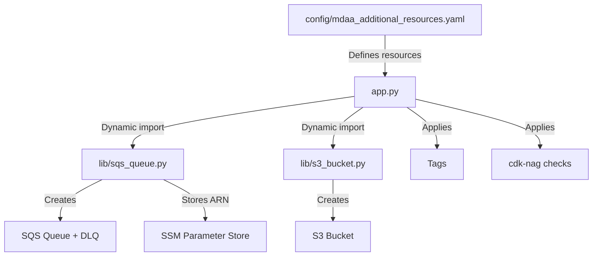
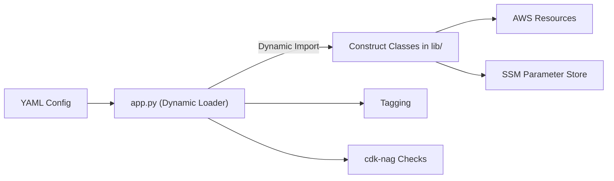

# MDAA Additional Resources CDK

This project provides a fully generic, dynamic, and extensible AWS CDK framework for deploying resources (like SQS, S3, etc.) based on YAML configuration. It enforces security and code best practices, supports tagging, and automatically stores resource ARNs in SSM Parameter Store.

---

## Architecture Overview



---

## YAML Structure

```yaml
project: mdaa
region: "il-central-1"
tags: ./tags.yaml

dev:
  resources:
    - type: sqs_queue
      QueueName: my-abstract-queue-dev-1
      VisibilityTimeout: 30
      env_tags: ./env_tags_dev.yaml
      ConsumerRoleArn: arn:aws:iam::123456789012:role/Admin
      DeadLetterQueue:
        MaxReceiveCount: 3
        QueueName: my-dlq-dev-1
```

- Add more environments (`prod`, `test`, etc.) as needed.
- Add more resource types by creating a new file in `lib/` (e.g., `lib/s3_bucket.py`) and referencing it in YAML.

---

## Extensibility
- **Add a new resource type:**
  1. Create `lib/{type}.py` with a `{Type}` class (e.g., `lib/s3_bucket.py` with `S3Bucket`).
  2. Reference it in YAML as `type: s3_bucket`.
- **No code changes needed elsewhere!**

---

## Security & Best Practices
- All SQS queues require DLQ and enforce SSL.
- All resources are tagged (global and env-specific).
- cdk-nag AWS Solutions checks are enforced.
- Resource ARNs are stored in SSM Parameter Store at `/mdaa/{env}/{resource_name}`.

---

## Deployment

1. **Install dependencies:**
   ```sh
   pip install -r requirements.txt
   ```
2. **Synthesize the stack:**
   ```sh
   cdk synth --app "python3 app.py --env dev"
   ```
3. **Deploy:**
   ```sh
   cdk deploy --app "python3 app.py --env dev"
   ```

---

## Diagrams

### High-Level Flow



---

## License
MIT 
